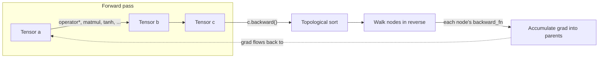

# gradus Architecture

## Data flow

Every operation (`operator+`, `operator*`, `matmul`, `tanh`, `relu`, `sum`)
allocates a new `TensorImpl` node, records its inputs as `parents`, and
stores a `backward_fn` closure implementing that operation's local
chain-rule step. `Tensor::backward()` does not know any calculus itself —
it topologically sorts the graph (parents before children) and calls each
node's `backward_fn` in reverse order, so gradient contributions flow from
the loss all the way back to the original leaf tensors.

## Decisions log

- **Single unified `Tensor`, not a separate scalar `Value` type.** A scalar
  is just a `Tensor` with shape `{1}`. Two parallel implementations would
  duplicate every operator's forward+backward logic for no benefit at this
  project's scale.
- **No `requires_grad` flag.** Every tensor always builds a graph node.
  Simpler, and v1's scope (XOR-scale examples) never needs to skip
  gradient tracking for performance.
- **No broadcasting.** Every elementwise operator requires an exact shape
  match; mismatches throw `std::invalid_argument`. Keeps every backward
  pass a simple parallel loop with no reduction-over-broadcast-dims logic.
- **Ownership via `shared_ptr<TensorImpl>`, closures capture the owning
  node by raw pointer.** Parent nodes are captured by `shared_ptr` (keeps
  them alive for as long as the graph exists); a node's own `backward_fn`
  captures *itself* by raw pointer, not `shared_ptr`, to avoid a reference
  cycle that `shared_ptr` could never free.
- **`-1.0`/`1.0` encoding for the XOR example**, not `0.0`/`1.0` — matches
  `tanh`'s output range, which trains faster than asking the network to
  reach `tanh`'s asymptotic extremes.
- **Per-layer incrementing RNG seed in `Linear`, not a fixed constant.**
  The first implementation reseeded `std::mt19937` with the same constant
  (`42`) in every `Linear` constructor. For the 2-layer XOR network this
  correlated the two layers' initial weights enough that gradient descent
  never broke symmetry between hidden units — the network converged to a
  constant output regardless of input (average loss plateaued at ~1.22,
  matching the closed-form loss of a constant ~0.46 prediction against
  the ±1 targets). Incrementing a static seed counter per `Linear`
  construction decorrelates layers while keeping every run fully
  reproducible. Diagnosed by tracing the per-epoch loss curve (flat after
  ~60 epochs) rather than guessing at hyperparameters.
- **Fused `softmax_cross_entropy_loss`, not composed from a separate
  `softmax()` + `log()`.** The combined gradient (`softmax(x) - one_hot`)
  is what every production framework computes directly — deriving it as
  a composition would need a full softmax Jacobian, which is both slower
  and numerically messier for no benefit. Implemented with the
  log-sum-exp trick (subtract the max logit before exponentiating) so
  `exp()` never overflows a `double`.
- **`MLP::activate_output` flag, default `true`.** v1's XOR network needed
  every layer (including the last) tanh-bounded; MNIST classification
  needs raw logits at the output for `softmax_cross_entropy_loss`. A flag
  serves both without duplicating `MLP`; the default preserves v1's exact
  existing behavior.
- **MNIST loaded from a CSV mirror, not the original IDX binary format.**
  Parsing IDX would be a file-format exercise orthogonal to this project's
  actual point (autograd internals) — a deliberate build-vs-buy call.
  Source verified live before use: `data.pjreddie.com/files/mnist_{train,test}.csv`.
- **Measured result (v2):** 89.5% test accuracy (8950/10000) after 5
  epochs on the full 60k-image training set, ~43s/epoch in a Release
  build on this machine — a real, run-once-and-confirmed number, not an
  estimate.
